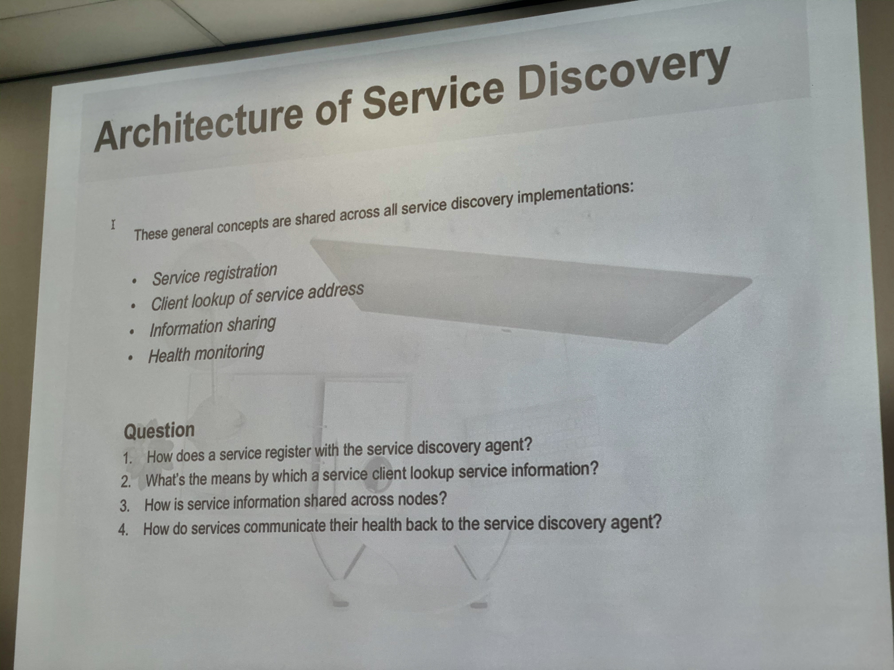

# SOP Discovery

Service discovery architecture in-class assignment of Service-Oriented Programming class, IT KMITL.

## Project Folders

`discovery` is the discovery server.

`client` is the client registered to the discovery server, basically a microservice.

`studentservice` is a microservice registered to the discovery server.

## Assignment

After the class, 4-question assignment is due.

